# Azure APIM Authentication Delegation Function App

[](https://opensource.org/licenses/MIT)
[](https://azure.microsoft.com/en-us/services/functions/)
[](https://nodejs.org/)
[](https://openid.net/connect/)
[](https://docs.microsoft.com/en-us/azure/azure-resource-manager/bicep/)
[](https://github.com/features/actions)

A production-ready Azure Function App that provides authentication delegation for Azure API Management (APIM) Developer Portal using any OIDC-compliant identity provider with automatic endpoint discovery.

## 🏗️ Architecture


## 📋 Overview

This solution implements the [Azure APIM delegation pattern](https://docs.microsoft.com/en-us/azure/api-management/api-management-howto-setup-delegation) to provide seamless authentication between APIM Developer Portal and Okta OIDC. It consists of three Azure Functions:

### Functions

| Function | Route | Purpose |
|----------|-------|---------|
| **delegation** | `/api/delegation` | Handles APIM delegation requests, validates signatures, and initiates OAuth flow |
| **auth-callback** | `/api/auth-callback` | Processes OAuth callbacks, manages APIM user creation, and handles SSO |
| **health** | `/api/health` | Health check endpoint for monitoring |

### Key Features

- ✅ **Secure signature validation** using APIM validation keys
- ✅ **Universal OIDC support** with automatic endpoint discovery
- ✅ **OAuth 2.0/OIDC integration** with any compliant provider
- ✅ **Automatic user provisioning** in APIM
- ✅ **SSO token generation** for seamless portal access
- ✅ **Production-ready infrastructure** with Bicep templates
- ✅ **Automated CI/CD deployment** with GitHub Actions
- ✅ **Comprehensive monitoring** and logging

### OIDC Endpoint Discovery

The solution automatically discovers OIDC endpoints using the standard `.well-known/openid_configuration` endpoint. If discovery fails, it falls back to configurable endpoint paths.

## 🚀 Quick Start

### Prerequisites & Permissions

- Azure subscription with APIM instance
- OIDC-compliant identity provider (Okta, Azure AD, Google, etc.)
- GitHub repository (for CI/CD deployment)
- Azure CLI installed locally
- Node.js 18+ for local development

### Required Azure Permissions

This section covers the permissions needed for deployment and runtime operation.

#### 📋 Deployment Permissions

**Who needs these:** The person or service principal deploying the Function App.

**Required Role:** `Contributor` on the target resource group.

**Or custom role with these permissions:**
```json
{
  "actions": [
    "Microsoft.Resources/resourceGroups/read",
    "Microsoft.Resources/resourceGroups/write",
    "Microsoft.Resources/deployments/*",
    "Microsoft.Web/serverfarms/*",
    "Microsoft.Web/sites/*",
    "Microsoft.Storage/storageAccounts/*",
    "Microsoft.Insights/components/*",
    "Microsoft.Authorization/roleAssignments/write"
  ]
}
```

**Note:** The `roleAssignments/write` permission is needed to grant the Function App's managed identity access to APIM.

#### 🔐 Runtime Permissions (Automatic)

**Who needs these:** The Function App's System-Assigned Managed Identity (automatic).

**What happens automatically:**
- Bicep template assigns `API Management Service Contributor` role to the Function App's managed identity
- This grants the runtime permissions needed to create users and generate SSO tokens
- **No manual configuration required for same-subscription deployments**

**Permissions granted:**
```json
{
  "actions": [
    "Microsoft.ApiManagement/service/users/*",
    "Microsoft.ApiManagement/service/read"
  ]
}
```

#### 🌐 Cross-Subscription Permissions (Manual)

**When needed:** Only for cross-subscription APIM scenarios.

**Manual steps required:**
1. **Deploy the Function App** first (in source subscription)
2. **Get the Managed Identity Principal ID** from the deployment output
3. **Assign role in target subscription:**

```bash
# Get the Function App's managed identity principal ID
az functionapp identity show --name <function-app-name> --resource-group <rg-name> --query principalId -o tsv

# Assign role in target subscription
az role assignment create \
  --assignee <principal-id> \
  --role "API Management Service Contributor" \
  --scope "/subscriptions/<apim-subscription-id>/resourceGroups/<apim-rg>/providers/Microsoft.ApiManagement/service/<apim-service>"
```

**Alternative:** Use manual access token (see Authentication Methods section above).

#### Custom Role Definition (Least Privilege)

For production environments, create a custom role with minimal permissions:

```json
{
    "properties": {
        "roleName": "APIM Delegation Function Deployer",
        "description": "Minimal permissions for APIM delegation function deployment",
        "assignableScopes": [
            "/subscriptions/<subscription-id>>"
        ],
        "permissions": [
            {
                "actions": [
                    "Microsoft.Resources/subscriptions/resourceGroups/read",
                    "Microsoft.Resources/subscriptions/resourceGroups/write",
                    "Microsoft.Resources/deployments/read",
                    "Microsoft.Resources/deployments/write",
                    "Microsoft.Resources/deployments/validate/action",
                    "Microsoft.Resources/deployments/operations/read",
                    "Microsoft.Resources/deployments/operationstatuses/read",

                    "Microsoft.Web/serverfarms/*",
                    "Microsoft.Web/sites/*",
                    "Microsoft.Storage/storageAccounts/*",
                    "Microsoft.Insights/components/*",
                    "Microsoft.OperationalInsights/workspaces/write",
                    "Microsoft.OperationalInsights/workspaces/read",

                    "Microsoft.ApiManagement/service/users/*",
                    "Microsoft.ApiManagement/service/read"
                    
                ],
                "notActions": [],
                "dataActions": [],
                "notDataActions": []
            }
        ]
    }
}
```

#### GitHub Actions Service Principal Setup

1. **Create Service Principal:**
```bash
az ad sp create-for-rbac \
  --name "apim-delegation-github-actions" \
  --role "Contributor" \
  --scopes "/subscriptions/{subscription-id}/resourceGroups/{resource-group}" \
  --sdk-auth
```

2. **Assign Additional APIM Permissions:**
```bash
az role assignment create \
  --assignee {service-principal-object-id} \
  --role "API Management Service Contributor" \
  --scope "/subscriptions/{subscription-id}/resourceGroups/{apim-resource-group}/providers/Microsoft.ApiManagement/service/{apim-service-name}"
```

3. **Store Credentials in GitHub Secrets:**
   - `AZURE_CREDENTIALS`: Output from step 1
   - `APIM_VALIDATION_KEY`: From APIM delegation settings
   - `OIDC_CLIENT_SECRET`: From your OIDC provider

### 1. Clone and Setup

```bash
git clone <your-repo-url>
cd apim-delegation-func
npm install
```

### 2. Configure Environment

Copy the environment template and configure your settings:

```bash
cp .env.example .env.local
# Edit .env.local with your configuration
```

### 3. Set Environment Variables

Set the required environment variables for your deployment:

```bash
# Required variables
export AZURE_SUBSCRIPTION_ID="your-subscription-id"
export AZURE_RESOURCE_GROUP="your-resource-group"
export APIM_VALIDATION_KEY="your-base64-validation-key"
export APIM_PORTAL_URL="https://your-apim.developer.azure-api.net"
export OIDC_ISSUER="https://your-domain.okta.com"
export OIDC_CLIENT_ID="your-client-id"
export OIDC_CLIENT_SECRET="your-client-secret"

# Optional variables (with defaults)
export APP_NAME="apim-delegation"  # Default: apim-delegation
export AZURE_LOCATION="eastus2"     # Default: eastus2
export AZURE_SKU="Y1"              # Default: Y1 (Consumption)
export RUNTIME="node"              # Default: node
```

### 4. Deploy Infrastructure

```bash
# Login to Azure
az login

# Deploy to any environment
./scripts/deploy.sh dev
./scripts/deploy.sh prod
./scripts/deploy.sh qa
./scripts/deploy.sh uat
# ... any environment name works!
```

### 5. Configure APIM Delegation

In your APIM instance, configure delegation settings:

1. Navigate to **Developer portal** > **Delegation**
2. Enable **Delegate sign-in & sign-up**
3. Set delegation URL: `https://<your-function-app>.azurewebsites.net/api/delegation`
4. Set validation key (base64 encoded)

## 🔐 Authentication Methods

This Function App supports two authentication methods to access the APIM Management API, depending on your deployment scenario:

### Same Subscription (Recommended) - Managed Identity

**Use this when:** Your Function App and APIM instance are in the same Azure subscription.

✅ **Advantages:**
- **Automatic authentication** - No manual token management required
- **Secure** - No secrets stored in environment variables
- **Automatic role assignment** - Bicep template grants required permissions
- **Token refresh handled automatically** - Azure manages token lifecycle

**How it works:**
1. Function App deploys with System-Assigned Managed Identity
2. Bicep template automatically assigns "API Management Service Contributor" role to the managed identity
3. At runtime, Function App uses managed identity to get access tokens from Azure
4. No `APIM_ACCESS_TOKEN` environment variable needed

**Required Environment Variables:**
```bash
# Basic APIM configuration (same subscription)
APIM_RESOURCE_GROUP=your-apim-resource-group
APIM_SERVICE_NAME=your-apim-service-name
# APIM_ACCESS_TOKEN not needed - managed identity handles this
```

### Cross Subscription (Advanced) - Manual Access Token

**Use this when:** Your Function App and APIM instance are in different Azure subscriptions.

⚠️ **Requirements:**
- Manual access token management
- Cross-subscription role assignments
- Token refresh handling (tokens expire)

**How it works:**
1. You provide an Azure Bearer token via `APIM_ACCESS_TOKEN` environment variable
2. Function App uses this token directly for APIM Management API calls
3. You're responsible for token refresh and role assignments

**Required Environment Variables:**
```bash
# Cross-subscription APIM configuration
APIM_RESOURCE_GROUP=your-apim-resource-group
APIM_SERVICE_NAME=your-apim-service-name
APIM_ACCESS_TOKEN=your-azure-bearer-token  # Required for cross-subscription
```

**Getting the Access Token:**

For testing:
```bash
az account get-access-token --resource=https://management.azure.com/ --query accessToken -o tsv
```

For production (Service Principal recommended):
```bash
az ad sp create-for-rbac --name "apim-delegation-sp" \
  --role "API Management Service Contributor" \
  --scopes "/subscriptions/{target-subscription-id}/resourceGroups/{apim-resource-group}"
```

### Authentication Flow Decision

```mermaid
graph TD
    A[Start Deployment] --> B{APIM in same subscription?}
    B -->|Yes| C[Use Managed Identity]
    B -->|No| D[Use Manual Access Token]
    
    C --> E[Set APIM_RESOURCE_GROUP & APIM_SERVICE_NAME]
    C --> F[Deploy - Bicep assigns roles automatically]
    C --> G[✅ Ready - No token management needed]
    
    D --> H[Set APIM_RESOURCE_GROUP, APIM_SERVICE_NAME & APIM_ACCESS_TOKEN]
    D --> I[Manually assign cross-subscription permissions]
    D --> J[Deploy with manual token]
    D --> K[⚠️ Monitor token expiration]
```



## 🔧 Configuration

### Required Environment Variables

| Variable | Description | Example |
|----------|-------------|---------|
| `APIM_VALIDATION_KEY` | Base64-encoded APIM validation key | `aW50ZWdyYXRpb24...` |
| `APIM_PORTAL_URL` | APIM Developer Portal URL | `https://contoso.developer.azure-api.net` |
| `OIDC_ISSUER` | OIDC provider issuer URL | `https://dev-123456.okta.com` |
| `OIDC_CLIENT_ID` | OIDC application client ID | `0oa1a2b3c4d5e6f7g8h9` |
| `OIDC_CLIENT_SECRET` | OIDC application client secret | `secretvalue` |
| `OIDC_REDIRECT_URI` | OAuth callback URL | `https://yourapp.azurewebsites.net/api/auth-callback` |

### Deployment Configuration

| Variable | Description | Default | Required |
|----------|-------------|---------|----------|
| `APP_NAME` | Application name for resources | `apim-delegation` | No |
| `AZURE_LOCATION` | Azure region for deployment | `eastus2` | No |
| `AZURE_SKU` | Function App pricing tier | `Y1` (Consumption) | No |
| `RUNTIME` | Function runtime | `node` | No |
| `APIM_RESOURCE_GROUP` | APIM resource group | | No |
| `APIM_SERVICE_NAME` | APIM service name | | No |

### Optional OIDC Endpoints

| Variable | Description | Default |
|----------|-------------|---------|
| `OIDC_AUTHORIZATION_ENDPOINT` | Custom authorization endpoint path | Auto-discovered |
| `OIDC_TOKEN_ENDPOINT` | Custom token endpoint path | Auto-discovered |
| `OIDC_USERINFO_ENDPOINT` | Custom userinfo endpoint path | Auto-discovered |

## 🏗️ Infrastructure

The solution uses Bicep templates for Infrastructure as Code with **environment-variable driven configuration**:

```
infrastructure/
├── main.bicep              # Main deployment template
└── modules/
    ├── function-app.bicep  # Function App resources
    ├── storage.bicep       # Storage account
    ├── app-insights.bicep  # Application Insights
    └── app-service-plan.bicep # App Service Plan
```

**No parameter files needed!** All configuration is provided via environment variables, making deployment more secure and flexible.

### Deployed Resources

- **Function App** (Consumption or Premium plan)
- **Storage Account** (for function app storage)
- **Application Insights** (for monitoring and logging)
- **App Service Plan** (if using Premium plan)

## 🌍 Environment-Variable Driven Deployment

This solution follows **12-Factor App** methodology with configuration entirely via environment variables:

### ✅ Benefits
- **No configuration in source control** - All sensitive data stays secure
- **Deploy to any environment** - `dev`, `prod`, `qa`, `uat`, `sandbox`, etc.
- **Flexible per deployment** - Different configurations without code changes
- **CI/CD friendly** - Works with any CI/CD platform
- **Secure by default** - No accidental secret commits

### 🔧 Using Environment Files

Create `.env.<environment>` files locally (these are git-ignored):

```bash
# .env.dev
AZURE_SUBSCRIPTION_ID=dev-subscription-id
AZURE_RESOURCE_GROUP=rg-apim-dev
APIM_VALIDATION_KEY=your-dev-validation-key
OIDC_ISSUER=https://dev.okta.com
# ... etc

# .env.prod  
AZURE_SUBSCRIPTION_ID=prod-subscription-id
AZURE_RESOURCE_GROUP=rg-apim-prod
APIM_VALIDATION_KEY=your-prod-validation-key
OIDC_ISSUER=https://prod.okta.com
# ... etc
```

Deploy with: `./scripts/deploy.sh dev` or `./scripts/deploy.sh prod`

### 🚀 Multiple Environment Examples

```bash
# Standard environments
./scripts/deploy.sh dev
./scripts/deploy.sh staging  
./scripts/deploy.sh prod

# Custom environments
./scripts/deploy.sh qa
./scripts/deploy.sh uat
./scripts/deploy.sh testing
./scripts/deploy.sh sandbox
./scripts/deploy.sh demo
```

## 🔄 CI/CD Pipeline

The GitHub Actions workflow provides automated deployment:

### Workflow Triggers
- **Push to main**: Deploys to production
- **Push to develop**: Deploys to staging
- **Pull requests**: Runs tests and validation

### Pipeline Stages
1. **Build & Test** - Install dependencies, run linting and tests
2. **Infrastructure** - Deploy/update Azure resources using Bicep
3. **Application** - Deploy function code
4. **Smoke Tests** - Verify deployment health

### Required GitHub Secrets

| Secret | Description |
|--------|-------------|
| `AZURE_CREDENTIALS` | Azure service principal credentials |
| `APIM_VALIDATION_KEY` | APIM validation key |
| `OIDC_CLIENT_SECRET` | OIDC client secret |

## 🧪 Local Development

### Setup Local Environment

```bash
# Install Azure Functions Core Tools
npm install -g azure-functions-core-tools@4

# Install dependencies
npm install

# Copy local settings template
cp local.settings.template.json local.settings.json
# Edit local.settings.json with your configuration
```

### Run Locally

```bash
# Start the function app
npm run start

# Or use Azure Functions Core Tools directly
func start
```

### Testing Endpoints

```bash
# Health check
curl http://localhost:7071/api/health

# Test delegation (requires valid APIM signature)
curl "http://localhost:7071/api/delegation?operation=SignIn&returnUrl=..."
```

## 📊 Monitoring & Logging

### Application Insights Integration

The function app is configured with Application Insights for:

- **Request tracking** and performance metrics
- **Dependency tracking** for external API calls
- **Custom telemetry** for business events
- **Error tracking** and exception handling

### Key Metrics to Monitor

- Function execution count and duration
- Authentication success/failure rates
- APIM API call success rates
- Error rates and exception types

### Log Analysis Queries

```kusto
// Authentication failures
traces
| where message contains "Signature validation failed"
| summarize count() by bin(timestamp, 1h)

// OAuth callback errors
exceptions
| where outerMessage contains "Auth callback error"
| project timestamp, outerMessage, details
```

## 🔒 Security Considerations

### Authentication Flow Security

1. **Signature Validation**: All APIM requests are validated using HMAC-SHA512
2. **State Parameter**: OAuth state includes timestamp and is validated for replay attacks
3. **Token Handling**: Access tokens are never logged or exposed
4. **HTTPS Only**: All communication uses HTTPS

### Best Practices

- Rotate APIM validation keys regularly
- Use Azure Key Vault for production secrets
- Monitor for unusual authentication patterns
- Implement rate limiting if needed

## 🛠️ Troubleshooting

### Common Issues

#### Signature Validation Failures
```
Error: Signature validation failed
```
**Solution**: Verify APIM validation key matches the one configured in APIM delegation settings.

#### OAuth Callback Errors
```
Error: Token exchange failed
```
**Solution**: Check OIDC client credentials and redirect URI configuration.

#### APIM User Creation Failures
```
Error: Missing APIM configuration
```
**Solution**: Ensure APIM management API credentials are properly configured.

#### Permission Denied Errors
```
Error: The client does not have authorization to perform action 'Microsoft.Web/sites/write'
```
**Solution**: Verify the service principal has the required Azure permissions listed in the Prerequisites section.

#### APIM Access Token Issues
```
Error: Unauthorized (401) when calling APIM Management API
```
**Solution**: 
1. Ensure the access token has `API Management Service Contributor` role
2. Verify the token scope includes the APIM resource
3. Check token expiration and refresh if needed

#### Resource Group Deployment Failures
```
Error: Deployment template validation failed
```
**Solution**: 
1. Verify the service principal has `Contributor` role on the target resource group
2. Ensure all required parameters are provided in the Bicep parameter files
3. Check for resource naming conflicts

### Authentication Troubleshooting

#### Same-Subscription Authentication Issues

**Problem:** `Managed Identity not available` error
```
Managed Identity not available. Either provide APIM_ACCESS_TOKEN or ensure Function App has System-Assigned Managed Identity enabled.
```

**Solutions:**
1. Verify System-Assigned Managed Identity is enabled:
   ```bash
   az functionapp identity show --name <function-app-name> --resource-group <rg-name>
   ```
2. Check that role assignment was created:
   ```bash
   az role assignment list --assignee <principal-id> --scope "/subscriptions/<sub-id>/resourceGroups/<apim-rg>"
   ```
3. Redeploy to ensure Bicep template creates the role assignment

**Problem:** `403 Forbidden` when accessing APIM Management API
```
HTTP 403: The client does not have authorization to perform action 'Microsoft.ApiManagement/service/users/read'
```

**Solutions:**
1. Verify the Function App's managed identity has the correct role:
   ```bash
   # Should show "API Management Service Contributor" role
   az role assignment list --assignee <principal-id>
   ```
2. Wait a few minutes for role assignment propagation
3. Check that `APIM_RESOURCE_GROUP` and `APIM_SERVICE_NAME` are correct

#### Cross-Subscription Authentication Issues

**Problem:** Token expired errors
```
HTTP 401: Unauthorized when calling APIM Management API
```

**Solutions:**
1. Generate a fresh access token:
   ```bash
   az account get-access-token --resource=https://management.azure.com/ --query accessToken -o tsv
   ```
2. For production, implement token refresh logic or use service principal
3. Verify the token has access to the target subscription

**Problem:** Cross-subscription role assignment issues
```
The client does not have authorization to perform action 'Microsoft.ApiManagement/service/users/write'
```

**Solutions:**
1. Manually assign the role in the target subscription:
   ```bash
   az role assignment create --assignee <function-app-principal-id> \
     --role "API Management Service Contributor" \
     --scope "/subscriptions/<apim-sub-id>/resourceGroups/<apim-rg>/providers/Microsoft.ApiManagement/service/<apim-service>"
   ```
2. Verify you're using the correct subscription context when generating tokens

#### General Authentication Debugging

**Enable detailed logging:**
```json
{
  "logging": {
    "logLevel": {
      "default": "Debug"
    }
  }
}
```

**Check Function App logs:**
```bash
az functionapp log tail --name <function-app-name> --resource-group <rg-name>
```

**Verify environment variables:**
```bash
az functionapp config appsettings list --name <function-app-name> --resource-group <rg-name>
```

### Debug Mode

Enable detailed logging by setting:
```json
{
  "logging": {
    "logLevel": {
      "default": "Debug"
    }
  }
}
```

## 📚 API Documentation

### Delegation Endpoint

**GET/POST** `/api/delegation`

Handles APIM delegation requests for sign-in operations.

**Query Parameters:**
- `operation` (required): Operation type (`SignIn`, `SignUp`, etc.)
- `returnUrl` (required): URL to return to after authentication
- `salt` (required): Random salt for signature validation
- `sig` (required): HMAC signature for request validation

**Response:**
- `302`: Redirect to Okta authorization URL
- `400`: Invalid request parameters
- `401`: Signature validation failed

### Auth Callback Endpoint

**GET** `/api/auth-callback`

Processes OAuth callback from Okta and completes APIM authentication.

**Query Parameters:**
- `code` (required): OAuth authorization code
- `state` (required): Base64-encoded state data

**Response:**
- `302`: Redirect to APIM portal with SSO token
- `400`: Invalid callback parameters
- `500`: Authentication processing error

### Health Check Endpoint

**GET** `/api/health`

Returns application health status.

**Response:**
```json
{
  "status": "healthy",
  "timestamp": "2024-01-01T00:00:00.000Z"
}
```

## 🤝 Contributing

1. Fork the repository
2. Create a feature branch (`git checkout -b feature/amazing-feature`)
3. Commit your changes (`git commit -m 'Add amazing feature'`)
4. Push to the branch (`git push origin feature/amazing-feature`)
5. Open a Pull Request

## 📄 License

This project is licensed under the MIT License - see the [LICENSE](LICENSE) file for details.

## 🆘 Support

For support and questions:

1. Check the [troubleshooting section](#-troubleshooting)
2. Review [Azure APIM delegation documentation](https://docs.microsoft.com/en-us/azure/api-management/api-management-howto-setup-delegation)
3. Open an issue in this repository

---

**Built with ❤️ for Azure APIM and Okta integration**