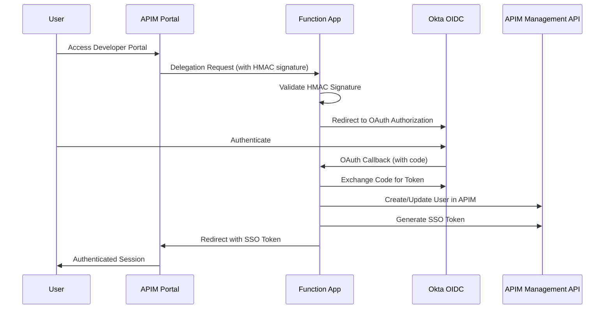

# Security Guide

This document outlines the security considerations and best practices for the Azure APIM Authentication Delegation Function App.

## 🔒 Security Architecture

### Authentication Flow Security



## 🛡️ Security Controls

### 1. Request Validation

#### HMAC Signature Verification
- All APIM delegation requests are validated using HMAC-SHA512
- Uses base64-decoded validation key from APIM configuration
- Prevents request tampering and replay attacks

```javascript
// Example signature validation
const keyBytes = Buffer.from(process.env.APIM_VALIDATION_KEY, 'base64');
const hmac = crypto.createHmac('sha512', keyBytes);
const computedSignature = hmac.update(stringToSign, 'utf8').digest('base64');
```

#### State Parameter Protection
- OAuth state parameter includes timestamp validation
- Prevents CSRF attacks and state replay
- 10-minute expiration window for state parameters

### 2. Transport Security

#### HTTPS Enforcement
- All communication uses HTTPS/TLS 1.2+
- Function App configured with `httpsOnly: true`
- HSTS headers enforced

#### CORS Configuration
- Restricted CORS origins
- Only Azure Portal allowed for management

### 3. Secret Management

#### Environment Variables
- Sensitive configuration stored as environment variables
- No secrets in source code or configuration files
- Use Azure Key Vault for production deployments

#### Required Secrets
| Secret | Purpose | Rotation Frequency |
|--------|---------|-------------------|
| `APIM_VALIDATION_KEY` | HMAC signature validation | Quarterly |
| `OKTA_CLIENT_SECRET` | OAuth client authentication | Annually |
| `APIM_ACCESS_TOKEN` | APIM Management API access | As needed |

### 4. Access Controls

#### Function App Security
- System-assigned managed identity enabled
- Minimum required permissions for APIM Management API
- No anonymous access except for HTTP triggers

#### Network Security
- Consider VNet integration for production
- IP restrictions if required
- Private endpoints for enhanced security

## 🔐 Best Practices

### 1. Secret Rotation

#### APIM Validation Key
```bash
# Generate new validation key in APIM
az apim update --name <apim-name> --resource-group <rg> --set properties.delegationSettings.validationKey="<new-key>"

# Update Function App configuration
az functionapp config appsettings set --name <function-app> --resource-group <rg> --settings APIM_VALIDATION_KEY="<new-key>"
```

#### Okta Client Secret
1. Generate new client secret in Okta Admin Console
2. Update Function App configuration
3. Test authentication flow
4. Remove old secret from Okta

### 2. Monitoring and Alerting

#### Security Events to Monitor
- Failed signature validations
- Unusual authentication patterns
- Token exchange failures
- Unexpected error rates

#### Application Insights Queries
```kusto
// Failed signature validations
traces
| where message contains "Signature validation failed"
| summarize count() by bin(timestamp, 1h)
| render timechart

// Authentication errors
exceptions
| where outerMessage contains "Auth callback error"
| summarize count() by bin(timestamp, 1h), outerMessage
```

### 3. Incident Response

#### Security Incident Checklist
1. **Immediate Response**
   - Disable affected Function App if necessary
   - Rotate compromised secrets
   - Review access logs

2. **Investigation**
   - Analyze Application Insights logs
   - Check for unauthorized access patterns
   - Verify APIM audit logs

3. **Recovery**
   - Deploy security patches
   - Update configurations
   - Test authentication flow

4. **Post-Incident**
   - Update security documentation
   - Improve monitoring rules
   - Conduct security review

## 🚨 Threat Model

### Identified Threats

#### 1. Request Forgery
- **Threat**: Malicious requests to delegation endpoint
- **Mitigation**: HMAC signature validation
- **Detection**: Monitor signature validation failures

#### 2. Token Interception
- **Threat**: OAuth tokens intercepted in transit
- **Mitigation**: HTTPS enforcement, short token lifetimes
- **Detection**: Monitor for unusual token usage patterns

#### 3. State Parameter Attacks
- **Threat**: CSRF attacks via state parameter manipulation
- **Mitigation**: Timestamp validation, secure state encoding
- **Detection**: Monitor for expired or invalid state parameters

#### 4. Credential Compromise
- **Threat**: Okta or APIM credentials compromised
- **Mitigation**: Regular rotation, secure storage
- **Detection**: Monitor for unauthorized API calls

### Risk Assessment Matrix

| Threat | Likelihood | Impact | Risk Level | Mitigation Status |
|--------|------------|--------|------------|-------------------|
| Request Forgery | Medium | High | High | ✅ Implemented |
| Token Interception | Low | High | Medium | ✅ Implemented |
| State Parameter Attacks | Low | Medium | Low | ✅ Implemented |
| Credential Compromise | Low | High | Medium | ⚠️ Ongoing |

## 🔍 Security Testing

### 1. Automated Security Tests

#### Unit Tests
- Signature validation logic
- State parameter handling
- Error handling scenarios

#### Integration Tests
- End-to-end authentication flow
- Token exchange validation
- APIM API integration

### 2. Security Scanning

#### Static Analysis
```bash
# Run security linting
npm audit
npm run lint

# Check for known vulnerabilities
npm audit --audit-level moderate
```

#### Dynamic Testing
- Penetration testing of authentication flow
- OWASP ZAP scanning
- Load testing with security focus

### 3. Compliance Validation

#### Security Checklist
- [ ] All secrets stored securely
- [ ] HTTPS enforced everywhere
- [ ] Input validation implemented
- [ ] Error handling doesn't leak information
- [ ] Logging doesn't contain sensitive data
- [ ] Access controls properly configured
- [ ] Monitoring and alerting configured

## 📋 Security Configuration

### Production Security Settings

#### Function App Configuration
```json
{
  "httpsOnly": true,
  "minTlsVersion": "1.2",
  "scmMinTlsVersion": "1.2",
  "ftpsState": "FtpsOnly",
  "clientAffinityEnabled": false,
  "publicNetworkAccess": "Enabled"
}
```

#### Application Settings Security
```bash
# Use Key Vault references for secrets
APIM_VALIDATION_KEY="@Microsoft.KeyVault(SecretUri=https://vault.vault.azure.net/secrets/apim-key/)"
OKTA_CLIENT_SECRET="@Microsoft.KeyVault(SecretUri=https://vault.vault.azure.net/secrets/okta-secret/)"
```

### Development Security Settings

#### Local Development
- Use separate Okta application for development
- Use test APIM instance
- Never use production secrets locally

#### Environment Isolation
- Separate Azure subscriptions/resource groups
- Different Okta tenants/applications
- Isolated monitoring and logging
